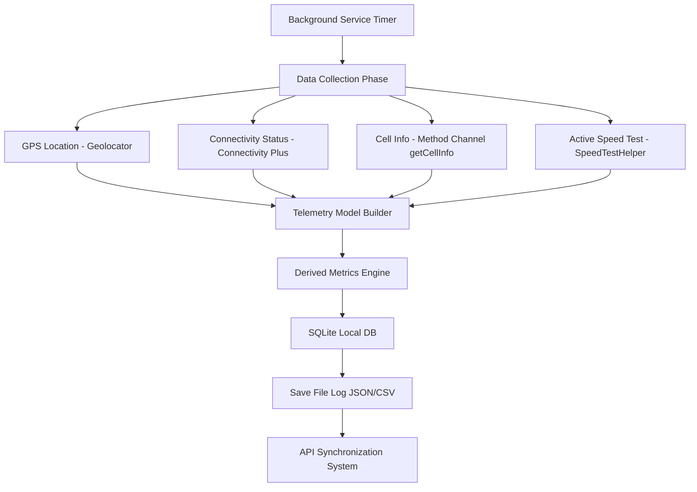
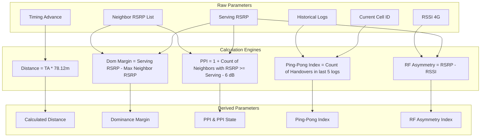

# SpeedCheck Application Introduction & Technical Guide

Welcome to the **SpeedCheck** Technical Guide and Application Introduction. This document provides a comprehensive breakdown of the application architecture, details every screen, explains how telemetry parameters are collected from the system, and demonstrates how derived parameters are calculated.

---

## 1. System Architecture & Data Flow

The SpeedCheck application is designed to monitor cellular network quality, signal strength, and bandwidth throughput in real-time. It runs a persistent background service to continuously log metrics, even when the device is locked or the application is in the background.

### High-Level Data Flow Diagram


The application logic flow operates in a continuous loop:
1. **Trigger**: A background periodic timer runs based on the user-defined frequency (10s, 30s, 1m, or 5m).
2. **Collect**: The service queries system geolocation, internet connectivity type, and native telephony metrics.
3. **Calculate**: The raw telephony inputs are processed by the **Derived Metrics Engine** to compute custom indexes (PPI, Dominance Margin, distance, etc.).
4. **Persist**: The final structured log is inserted into the local SQLite database and written as raw JSON/CSV files if configured.
5. **Sync**: The service sends the cached records to the remote SpeedCheck API endpoint if a network connection is available.

---

## 2. Screen-by-Screen Walkthrough

### 2.1 Onboarding & Permissions Screen
The onboarding view ([onboarding_view.dart](file:///Users/admin/IdeaProjects/speedcheck/lib/views/onboarding_view.dart)) is the first screen shown to new users. It handles the critical task of requesting the required Android and iOS permissions for cellular telemetry monitoring.

#### Visual Elements
- **Header**: Icon and description explaining the purpose of telemetry.
- **Permission Cards**:
  1. **GPS Location Access**: Cyan card explaining location needs.
  2. **Phone & Cellular Status**: Amber card explaining access to signal levels and carrier parameters.
  3. **Notification Services**: Pink card explaining background persistence.
- **Action Button**: Dynamic button that transitions from "GRANT ALL PERMISSIONS" (blue/cyan) to "CONTINUE TO DASHBOARD" (green) once all permissions are granted.

#### Telemetry Implications
Without these permissions, the platform APIs (TelephonyManager and Geolocator) will reject queries, resulting in null values across all parameters.

> **Screen Placeholder: Onboarding & Permissions**
> 

---

### 2.2 Home View (Main Dashboard)
The Home View ([home_view.dart](file:///Users/admin/IdeaProjects/speedcheck/lib/views/home_view.dart)) serves as the primary dashboard for real-time network parameter monitoring. It adjusts its layout dynamically based on the current active cellular technology (5G, 4G, 3G, or 2G).

#### Visual Elements & Parameters Displayed
- **Header Bar**: Displays the application name and a "Clear DB History" sweep button.
- **Control Deck**: Found at the bottom. Includes the **SYNC** button to push telemetry logs manually, and the **START TEST / STOP TEST** button to toggle the background service.
- **GPS Location & Device Card**: Displays GPS coordinates (latitude, longitude), GPS Accuracy, Speed, Device Model, OS Version, IMEI/Android ID, and Logged Timestamp.
- **General & Operator Identifiers**: Displays carrier name, MCC, MNC, Registered State (e.g. serving), Data Connection State, and active network technology mode.
- **Signal Telemetry Grid (Live Link)**: Displays key signal metrics depending on the active technology:
  - **5G**: SS-RSRP, SS-SINR, SS-RSRQ, and Cell ID (NCI).
  - **4G**: RSRP, RSSNR, RSRQ, and Cell ID (CI).
  - **3G**: RSCP, Ec/No, ASU Level, and Cell ID (UCID).
  - **2G**: RSSI, RxQual, ASU Level, and Cell ID (CID).
- **Signal Quality Card**: Features a progress indicator rating the overall channel health (Optimal, Fair, or Poor).
- **Technology-Specific Detail Cards**: Detailed breakdowns for 5G NR (PCI, TAC, NRARFCN, Band, Bandwidth, BWP, CSI-RSRP, etc.), 4G LTE (PCI, TAC, EARFCN, Band, Bandwidth, Timing Advance, distance), 3G WCDMA (PSC, LAC, UARFCN), and 2G GSM (BSIC, LAC, ARFCN).
- **Speed Diagnostics Card**: Active download speed, upload speed, latency (Ping), jitter, and packet loss.
- **Telemetry Events Log**: Lists the 5 most recent system changes (e.g. cell locks, handovers, and GPS fixes).

> **Screen Placeholder: Home Dashboard**
> 

---

### 2.3 Neighbor Diagnostic Deck
The Neighbors View ([neighbors_view.dart](file:///Users/admin/IdeaProjects/speedcheck/lib/views/neighbors_view.dart)) analyzes surrounding cell towers. This deck is essential for discovering signal overlap, detecting interference, and predicting handovers.

#### Visual Elements & Parameters Displayed
- **Header**: Navigation label showing "Neighbor Diagnostic Deck".
- **Derived RF Metrics Card**: Displays computed indicators (Neighbors count, PPI, Pilot Pollution State, Serving Cell Dominance Margin, Handover Ping-Pong Index, RF Asymmetry Index).
- **Detected Neighbor Cells Table**: A horizontal scrolling table displaying:
  - **CELL**: Index of the neighboring cell.
  - **TECH**: Access technology (5G, 4G, 3G, 2G).
  - **PCI/PSC/BSIC**: Hardware cell identifier (PCI for 4G/5G, PSC for WCDMA, BSIC for GSM).
  - **SIGNAL**: Signal level (RSRP for 4G/5G, RSCP for 3G, RxLev for 2G).
  - **RSRQ**: Signal quality (4G/5G).
  - **FREQUENCY**: Carrier frequency channel number (EARFCN, UARFCN, or ARFCN).

> **Screen Placeholder: Neighbor Diagnostic Deck**
> 

---

### 2.4 Signal Trend Splines (Charts)
The Charts View ([charts_view.dart](file:///Users/admin/IdeaProjects/speedcheck/lib/views/charts_view.dart)) displays historical trends for signal parameters as smooth spline graphs.

#### Visual Elements & Parameters Displayed
- **Active Channel Mode**: Shows current serving technology.
- **Dynamic Splines**: Displays 2 to 6 charts depending on the active tech:
  - **5G**: SS-RSRP, SS-RSRQ, SS-SINR, CSI-RSRP, CSI-RSRQ, and CSI-SINR splines.
  - **4G**: RSRP, RSRQ, RSSI, and RSSNR splines.
  - **3G**: RSCP and Ec/No splines.
  - **2G**: RSSI and RxQual splines.
- **Y-Axis**: Automatically calculates minimum and maximum boundaries based on the visible dataset to provide clean, detailed visual trends.
- **X-Axis**: Timestamps representing historical background samples.

> **Screen Placeholder: Signal Trend Splines**
> 

---

### 2.5 Settings & Configuration
The Settings View ([settings_view.dart](file:///Users/admin/IdeaProjects/speedcheck/lib/views/settings_view.dart)) provides tools to adjust database options, directory locations, and background sampling parameters.

#### Visual Elements & Configuration Parameters
- **Log Storage Configuration**:
  - **Storage Location**: Root folder where files are stored (e.g. `/Documents/SpeedCheck/Logs`).
  - **Log Format**: Selector dropdown supporting `SQLite (DB)`, `JSON File`, and `CSV File`.
  - **File Naming Convention**: Input pattern for text files (supports `TIMESTAMP` tag replacement).
  - **Auto-Purge Logs Switch**: Toggles automatic cleanup of local logs older than 30 days.
- **Data & Sync Settings**:
  - **Sync only on Wi-Fi Switch**: Restricts background API synchronization to Wi-Fi connections to save mobile data.
  - **Logging Frequency Dropdown**: Set sampling intervals of `10 seconds`, `30 seconds`, `1 minute`, or `5 minutes`.
- **About Info Card**: Displays application version details, privacy policy, and support contacts.

> **Screen Placeholder: Settings Screen**
> 

---

### 2.6 License View
The License View ([license_view.dart](file:///Users/admin/IdeaProjects/speedcheck/lib/views/license_view.dart)) contains corporate ownership parameters and system diagnostics audits.

#### Visual Elements
- **License Status Badge**: Shows a green indicator reading `ACTIVE`.
- **Enterprise Network License Details**: Owner (Insta ICT Solutions Pvt Ltd), License Key, Assigned Node ID, validity date, usage limits, and API sync permissions.
- **Node Audit Logs**: Displays terminal-style audit trails indicating license validation, API handshakes, and diagnostic core initializations.

> **Screen Placeholder: License View**
> 

---

## 3. How Parameters are Collected

Cellular parameters are collected via native platform integration. Since Flutter runs in a sandboxed Dart VM, native Android and iOS APIs must be accessed using platform channels.

### Method Channel Collection
When the background service timer triggers, it calls:
```dart
final result = await cellChannel.invokeMethod('getCellInfo');
```
This is mapped in [background_service.dart](file:///Users/admin/IdeaProjects/speedcheck/lib/background_service.dart). On Android, this triggers native Java/Kotlin code that communicates with the `TelephonyManager` API.

#### Parameter Mapping Table

| Parameter | Source API / Package | Description | Mapped Type |
| :--- | :--- | :--- | :--- |
| **Latitude / Longitude** | `geolocator` | GPS positioning coordinates | `double` |
| **GPS Accuracy / Speed** | `geolocator` | Error radius in meters / GPS movement speed | `double` |
| **Carrier Name** | `TelephonyManager.getSimOperatorName()` | Network operator name | `String` |
| **Technology** | `TelephonyManager.getDataNetworkType()` | Mapped network speed (2G, 3G, 4G, 5G SA/NSA) | `String` |
| **Cell ID (CI/NCI/UCID/CID)**| `CellIdentity` (Android Telephony) | Global unique identifier of the serving cell tower | `String` or `int` |
| **RSRP / RSCP / RSSI** | `CellSignalStrength` (Android Telephony) | Serving signal power level (dBm) | `int` |
| **RSRQ / EcNo / RxQual** | `CellSignalStrength` (Android Telephony) | Serving signal quality indicator (dB) | `int` |
| **Timing Advance (TA)** | `CellSignalStrengthLte` / `Nr` | Signal propagation delay value | `int` |
| **EARFCN / NRARFCN** | `CellInfo` frequency channel | Absolute radio frequency channel number | `int` |
| **Neighbor Cells** | `TelephonyManager.getAllCellInfo()` | Surrounding inactive/neighbor cell list | `List<Map>` |
| **Download / Upload Speed**| `SpeedTestHelper` | Speed test throughput (Mbps) | `double` |
| **Ping / Jitter / Packet Loss**| `SpeedTestHelper` | Network latency & packet transmission metrics | `double` |
| **IMEI / Android ID** | `device_info_plus` | Unique hardware device identifier | `String` |

---

## 4. How Derived Parameters are Calculated

Raw metrics directly represent radio signals. However, derived metrics are needed to interpret overall network performance, interference, stability, and geometry. These are calculated dynamically inside the application logic.

### Derived Parameters Pipeline


### 4.1 Calculated Distance to Base Station
- **Source**: Timing Advance (TA) parameter from 4G LTE.
- **Formula**:
  $$\text{Distance (meters)} = \text{Timing Advance} \times 78.12$$
- **Logic**: Timing Advance values represent propagation delay steps. In LTE, each step of TA corresponds to approximately $78.12\text{ meters}$ of distance between the device and the antenna mast.
- **Code Reference**:
  ```dart
  double? calculateDistance(int? ta) {
    if (ta == null || ta <= 0) return null;
    return ta * 78.12;
  }
  ```

### 4.2 Serving Cell Dominance Margin
- **Source**: Serving cell signal strength, neighbor cells list, active technology.
- **Formula**:
  $$\text{Dominance Margin (dB)} = \text{Serving RSRP} - \max(\text{Neighbor RSRP of same technology})$$
- **Logic**: Measures how dominant the serving signal is compared to the strongest neighbor. A high margin (e.g. $> 10\text{ dB}$) represents a stable serving cell environment. A low margin (e.g. $< 3\text{ dB}$) indicates that the serving and neighbor signals are of similar strength, which may trigger handovers.
- **Code Reference**:
  ```dart
  double? calculateDominanceMargin(int? servingRsrp, List<Map<String, dynamic>> neighbors, String? tech) {
    if (servingRsrp == null || neighbors.isEmpty) return null;
    int? maxNeighborRsrp;
    for (final neigh in neighbors) {
      if (neigh['tech'] == tech) {
        final rsrpVal = neigh['rsrp'] as int?;
        if (rsrpVal != null) {
          if (maxNeighborRsrp == null || rsrpVal > maxNeighborRsrp) {
            maxNeighborRsrp = rsrpVal;
          }
        }
      }
    }
    if (maxNeighborRsrp == null) return null;
    return (servingRsrp - maxNeighborRsrp).toDouble();
  }
  ```

### 4.3 Pilot Pollution Index (PPI) & State
- **Source**: Serving cell signal strength, neighbor cells list, active technology.
- **Formula**:
  $$\text{PPI} = 1 + \sum_{i=1}^{n} [1 \text{ if } \text{Neighbor RSRP}_{i} \ge (\text{Serving RSRP} - 6\text{ dB}) \text{ else } 0]$$
- **State Threshold**:
  $$\text{PPI State} = \begin{cases} 
    \text{Polluted} & \text{if } \text{PPI} \ge 4 \\ 
    \text{Clean} & \text{if } \text{PPI} < 4 
  \end{cases}$$
- **Logic**: Evaluates whether too many cell towers are reaching the device with comparable strength. If 4 or more towers are within $6\text{ dB}$ of each other, it leads to pilot pollution, causing high interference and rapid battery drain.
- **Code Reference**:
  ```dart
  int calculatePpi(int? servingRsrp, List<Map<String, dynamic>> neighbors, String? tech) {
    if (servingRsrp == null) return 1;
    int count = 1; // serving cell itself
    for (final neigh in neighbors) {
      if (neigh['tech'] == tech) {
        final rsrpVal = neigh['rsrp'] as int?;
        if (rsrpVal != null && rsrpVal >= (servingRsrp - 6)) {
          count++;
        }
      }
    }
    return count;
  }
  ```

### 4.4 Handover Ping-Pong Index
- **Source**: Active cell identifier history (last 5 database log entries).
- **Formula**:
  $$\text{Ping-Pong Index} = \sum_{j=1}^{m} [1 \text{ if } \text{CellID}_{j} \neq \text{CellID}_{j-1} \text{ else } 0]$$
- **Logic**: Counts how many times the serving cell ID changed over the last 5 logs. A high handover count indicates ping-pong behavior, where the connection bounces rapidly between towers, resulting in dropped packets and poor performance.
- **Code Reference**:
  ```dart
  Future<int> calculatePingPongIndex(String? currentCellId) async {
    if (currentCellId == null) return 0;
    final lastLogs = await DatabaseHelper.instance.getAllLogs(limit: 5);
    if (lastLogs.length < 3) return 0;

    final cellIds = [currentCellId];
    for (final log in lastLogs) {
      if (log.cellId != null) {
        cellIds.add(log.cellId!);
      }
    }

    int handovers = 0;
    for (int i = 1; i < cellIds.length; i++) {
      if (cellIds[i] != cellIds[i - 1]) {
        // Handover detected
        handovers++;
      }
    }
    return handovers;
  }
  ```

### 4.5 RF Asymmetry Index
- **Source**: Reference Signal Received Power (RSRP) and Received Signal Strength Indicator (RSSI) for 4G LTE.
- **Formula**:
  $$\text{Asymmetry (dB)} = \text{RSRP} - \text{RSSI}$$
- **Logic**: Helps measure the dispersion and load of the LTE channel. A significant shift in asymmetry points to high cellular network loading or poor multi-path conditions.
- **Code Reference**:
  ```dart
  double? calculateRfAsymmetry(int? rsrp, int? rssi) {
    if (rsrp == null || rssi == null) return null;
    return (rsrp - rssi).toDouble();
  }
  ```

### 4.6 Band Name Mapping
- **Source**: Absolute frequency channel numbers (EARFCN for 4G LTE, NRARFCN for 5G NR).
- **Logic**: The hardware reports frequency channels as raw numbers. The application maps these to human-readable LTE bands (e.g. B1, B3, B40) and 5G bands (e.g. n78, n28) using standard 3GPP frequency allocation rules.
- **Code Reference**:
  - [background_service.dart (lines 48-62)](file:///Users/admin/IdeaProjects/speedcheck/lib/background_service.dart#L48-L62) for `getLteBand(earfcn)`.
  - [background_service.dart (lines 66-80)](file:///Users/admin/IdeaProjects/speedcheck/lib/background_service.dart#L66-L80) for `getNrBand(nrarfcn, systemBands)`.

---

This technical guide serves as the foundation for the SpeedCheck application's monitoring capabilities. Direct any questions regarding API integration to the engineering team.
