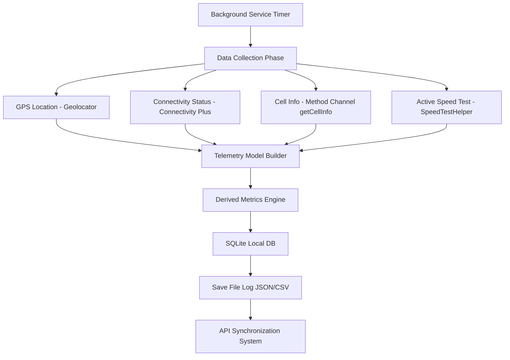
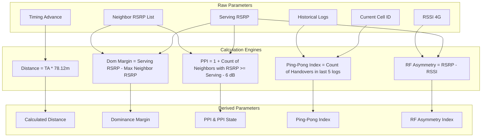

# SpeedCheck ॲप्लिकेशन ओळख आणि तांत्रिक मार्गदर्शिका

**SpeedCheck** तांत्रिक मार्गदर्शिका आणि ॲप्लिकेशन ओळखीमध्ये आपले स्वागत आहे. हे दस्तऐवज ॲप्लिकेशनचे आर्किटेक्चर, प्रत्येक स्क्रीनचे तपशील, सिस्टीममधून टेलीमेट्री पॅरामीटर्स कसे गोळा केले जातात आणि डिराइव्हड (derived) पॅरामीटर्सचे मोजमाप कसे केले जाते याची सविस्तर माहिती देते.

---

## १. सिस्टीम आर्किटेक्चर आणि डेटा प्रवाह (System Architecture & Data Flow)

SpeedCheck ॲप हे मोबाईलचे सेल्युलर नेटवर्क, सिग्नल सामर्थ्य आणि इंटरनेट गतीचे रिअल-टाईम निरीक्षण करण्यासाठी डिझाइन केले आहे. हे ॲप पार्श्वभूमीत (background) सतत कार्यरत राहून नेटवर्कचे मोजमाप नोंदवत राहते, अगदी फोन लॉक असताना किंवा ॲप बंद असतानाही हे काम सुरू राहते.

### डेटा प्रवाह आकृती (Data Flow Diagram)


ॲपची कार्यपद्धती खालील चक्रानुसार चालते:
१. **ट्रीगर (Trigger)**: युझरने ठरवलेल्या वेळेनुसार (१० सेकंद, ३० सेकंद, १ मिनिट किंवा ५ मिनिटे) बॅकग्राउंड टायमर सुरू होतो.
२. **डेटा गोळा करणे (Collect)**: सिस्टीमचे GPS लोकेशन, इंटरनेट कनेक्टिव्हिटी प्रकार आणि मोबाईल नेटवर्कचे मूळ पॅरामीटर्स गोळा केले जातात.
३. **मोजमाप (Calculate)**: गोळा केलेल्या कच्च्या डेटावर **डिराइव्हड मॅट्रिक्स इंजिन** प्रक्रिया करून महत्वाचे निकष (PPI, डोमिनन्स मार्जिन, अंतर इ.) मोजते.
४. **डेटा जतन करणे (Persist)**: तयार झालेली माहिती स्थानिक SQLite डेटाबेसमध्ये आणि ठरवल्यास JSON/CSV फाईलमध्ये सेव्ह केली जाते.
५. **सिंक (Sync)**: इंटरनेट सुरू असल्यास स्थानिक डेटाबेस मधील नोंदी रिमोट SpeedCheck API वर पाठवल्या जातात.

---

## २. स्क्रीन-बाय-स्क्रीन तपशील (Screen Walkthrough)

### २.१ ऑनबोर्डिंग आणि परवानग्या स्क्रीन (Onboarding & Permissions Screen)
नवीन युझरला ॲप सुरू करताना सर्वप्रथम ऑनबोर्डिंग स्क्रीन ([onboarding_view.dart](file:///Users/admin/IdeaProjects/speedcheck/lib/views/onboarding_view.dart)) दिसते. ही स्क्रीन टेलीमेट्री डेटा मोजण्यासाठी आवश्यक असलेल्या अँड्रॉइड आणि आयओएस परवानग्या मिळवण्याचे काम करते.

#### स्क्रीनवरील प्रमुख घटक
- **हेडर**: टेलीमेट्री गोळा करण्याचा उद्देश स्पष्ट करणारा संदेश.
- **परवानग्या कार्डे**:
  १. **GPS Location Access**: अचूक स्थान, गती आणि अचूकतेचे पॅरामीटर्स मोजण्यासाठी लोकेशन परवानगी.
  २. **Phone & Cellular Status**: नेटवर्क तंत्रज्ञान (2G/3G/4G/5G), ऑपरेटरचे नाव, सेल आयडी (Cell ID) आणि सिग्नल लेव्हल वाचण्यासाठी फोन परवानगी.
  ३. **Notification Services**: बॅकग्राउंडमध्ये लॉगिंग सुरू ठेवण्यासाठी लागणारी नोटिफिकेशन परवानगी.
- **ॲक्शन बटन**: सर्व परवानग्या मिळेपर्यंत हे बटन निळ्या रंगात "GRANT ALL PERMISSIONS" असे दिसते. सर्व परवानग्या मिळाल्यावर ते हिरव्या रंगात "CONTINUE TO DASHBOARD" असे बदलते.

#### टेलीमेट्रीवरील प्रभाव
या परवानग्या न दिल्यास सिस्टीमचे टेलिफोनी मॅनेजर आणि लोकेशन सर्व्हिसेस डेटा देण्यास नकार देतात, ज्यामुळे सर्व मोजमापे रिक्त (null) राहतात.

> **स्क्रीन जागा: ऑनबोर्डिंग आणि परवानग्या (Onboarding & Permissions)**
> 

---

### २.२ मुख्य डॅशबोर्ड (Home View - Main Dashboard)
होम स्क्रीन ([home_view.dart](file:///Users/admin/IdeaProjects/speedcheck/lib/views/home_view.dart)) हा ॲपचा मुख्य डॅशबोर्ड आहे. सध्या फोन ज्या नेटवर्क तंत्रज्ञानावर (5G, 4G, 3G किंवा 2G) कार्यरत आहे, त्यानुसार या स्क्रीनचा लेआउट बदलतो.

#### स्क्रीनवरील प्रमुख घटक आणि मोजमापे
- **हेडर बार**: ॲपचे नाव आणि डेटाबेस रिकामी करण्यासाठी "Clear DB History" बटन.
- **कंट्रोल डेक (तळाशी असणारी बटणे)**: डेटा मॅन्युअली सर्व्हरवर पाठवण्यासाठी **SYNC** बटन आणि बॅकग्राउंड सेवा सुरू किंवा बंद करण्यासाठी **START TEST / STOP TEST** बटन.
- **GPS लोकेशन आणि डिव्हाइस कार्ड**: GPS अक्षांश-रेखांश, अचूकता, गती, डिव्हाइसचे मॉडेल, ओएस व्हर्जन, IMEI क्रमांक आणि वेळ दर्शवते.
- **सामान्य आणि ऑपरेटर माहिती**: ऑपरेटरचे नाव, MCC (मोबाईल कंट्री कोड), MNC (मोबाईल नेटवर्क कोड), डेटा कनेक्शन स्थिती आणि नेटवर्क मोड दर्शवते.
- **सिग्नल टेलीमेट्री ग्रीड (थेट जोडणी)**: नेटवर्क तंत्रज्ञानानुसार खालील मुख्य मोजमापे दाखवते:
  - **5G**: SS-RSRP, SS-SINR, SS-RSRQ, आणि NCI (Cell ID).
  - **4G**: RSRP, RSSNR, RSRQ, आणि CI (Cell ID).
  - **3G**: RSCP, Ec/No, ASU Level, आणि UCID (Cell ID).
  - **2G**: RSSI, RxQual, ASU Level, आणि CID (Cell ID).
- **सिग्नल गुणवत्ता कार्ड (Signal Quality)**: सिग्नलच्या आरोग्यानुसार गुणवत्ता पातळी (Optimal - सर्वोत्तम, Fair - मध्यम, किंवा Poor - कमकुवत) दर्शवते.
- **नेटवर्क स्पेसिफिक कार्डे**: तंत्रज्ञानानुसार अधिक तपशील दर्शवणारी कार्डे (उदा. 5G मधील PCI, TAC, NRARFCN, बँड, बँडविड्थ किंवा 4G मधील Timing Advance व बेस स्टेशनचे अंतर).
- **स्पीड डायग्नोस्टिक्स कार्ड**: डाउनलोड गती, अपलोड गती, पिंग (Ping), जिटर (Jitter) आणि पॅकेट लॉस (Packet Loss).
- **इव्हेंट्स लॉग**: नुकतेच घडलेले ५ मोठे बदल (उदा. नवीन सेल आयडी लॉक, GPS स्थिती बदल किंवा हँडओव्हर) यांची यादी.

> **स्क्रीन जागा: मुख्य डॅशबोर्ड (Home View)**
> 

---

### २.३ शेजारील सेल विश्लेषण (Neighbor Diagnostic Deck)
शेजारील सेल स्क्रीन ([neighbors_view.dart](file:///Users/admin/IdeaProjects/speedcheck/lib/views/neighbors_view.dart)) आजूबाजूला उपलब्ध असणाऱ्या इतर मोबाईल टॉवर्सचा अभ्यास करते. हँडओव्हर अंदाज आणि सिग्नलच्या हस्तक्षेपाचा (interference) मागोवा घेण्यासाठी हे उपयुक्त आहे.

#### स्क्रीनवरील प्रमुख घटक आणि मोजमापे
- **हेडर**: "Neighbor Diagnostic Deck" हे मुख्य नाव.
- **डिराइव्हड आरएफ मॅट्रिक्स कार्ड**: आजूबाजूला सापडलेले टॉवर्स, पायलट पोल्युशन इंडेक्स (PPI), पायलट पोल्युशन स्थिती, डोमिनन्स मार्जिन, पिंग-पॉन्ग इंडेक्स आणि आरएफ असिमेट्री इंडेक्स दर्शवते.
- **शेजारील सेल तक्ता (Neighbors Table)**: आडवा स्क्रोल होणारा तक्ता ज्यामध्ये खालील बाबी असतात:
  - **CELL**: शेजारील सेलचा अनुक्रमांक.
  - **TECH**: नेटवर्क प्रकार (5G, 4G, 3G, 2G).
  - **PCI/PSC/BSIC**: टॉवरचे हार्डवेअर आयडी.
  - **SIGNAL**: सिग्नलची ताकद (RSRP/RSCP/RxLev - dBm मध्ये).
  - **RSRQ**: सिग्नलची गुणवत्ता (4G/5G साठी).
  - **FREQUENCY**: चॅनेल फ्रिक्वेन्सी क्रमांक (EARFCN, UARFCN, किंवा ARFCN).

> **स्क्रीन जागा: शेजारील सेल विश्लेषण (Neighbors View)**
> 

---

### २.४ सिग्नल ट्रेंड चार्ट (Signal Trend Splines)
चार्ट स्क्रीन ([charts_view.dart](file:///Users/admin/IdeaProjects/speedcheck/lib/views/charts_view.dart)) वेळेनुसार सिग्नलच्या पॅरामीटर्समध्ये होणारे बदल आलेख (spline graph) स्वरूपात दर्शवते.

#### स्क्रीनवरील प्रमुख घटक
- **सक्रिय चॅनेल मोड**: चालू नेटवर्क प्रकार दर्शवतो.
- **डायनॅमिक आलेख**: सध्याच्या नेटवर्कनुसार योग्य आलेखांची निवड होते:
  - **5G**: SS-RSRP, SS-RSRQ, SS-SINR, CSI-RSRP, CSI-RSRQ, आणि CSI-SINR चे ट्रेंड आलेख.
  - **4G**: RSRP, RSRQ, RSSI, आणि RSSNR चे आलेख.
  - **3G**: RSCP आणि Ec/No चे आलेख.
  - **2G**: RSSI आणि RxQual चे आलेख.
- **Y-अक्ष (Y-Axis)**: आलेख स्पष्ट दिसण्यासाठी डेटाच्या मूल्यानुसार स्वतःहून मर्यादा ठरवतो.
- **X-अक्ष (X-Axis)**: भूतकाळातील वेळेची नोंद दर्शवतो.

> **स्क्रीन जागा: सिग्नल ट्रेंड चार्ट (Charts View)**
> 

---

### २.५ सेटिंग्ज आणि कॉन्फिगरेशन (Settings & Configuration)
सेटिंग्ज स्क्रीन ([settings_view.dart](file:///Users/admin/IdeaProjects/speedcheck/lib/views/settings_view.dart)) डेटाबेस, फाईल साठवणूक आणि बॅकग्राउंड फ्रिक्वेन्सी व्यवस्थापित करण्यासाठीचे पर्याय पुरवते.

#### स्क्रीनवरील प्रमुख पर्याय
- **लॉग स्टोरेज कॉन्फिगरेशन (Log Storage)**:
  - **स्टोरेज डिरेक्टरी**: फाईल साठवण्याचा रस्ता (उदा. `/Documents/SpeedCheck/Logs`).
  - **लॉग स्वरूप (Log Format)**: `SQLite (DB)`, `JSON File`, किंवा `CSV File` निवडण्याचा पर्याय.
  - **फाईल नेमिंग पद्धत**: जतन केल्या जाणाऱ्या फाईलच्या नावाचे स्वरूप.
  - **ऑटो-पर्ज पर्याय**: ३० दिवसांपेक्षा जुने लॉग डेटाबेसमधून आपोआप काढून टाकणे.
- **डेटा आणि सिंक सेटिंग्ज (Data & Sync)**:
  - **फक्त वाय-फाय वर सिंक करा (Sync on Wi-Fi)**: मोबाईल डेटा वाचवण्यासाठी फक्त वाय-फाय सुरू असतानाच डेटा सर्व्हरवर सिंक करणे.
  - **लॉगिंग फ्रिक्वेन्सी**: १० सेकंद, ३० सेकंद, १ मिनिट किंवा ५ मिनिटे यापैकी नोंदी घेण्याची वेळ ठरवणे.
- **ॲप माहिती कार्ड**: ॲपची आवृत्ती (version), प्रायव्हसी पॉलिसी आणि सपोर्ट कॉन्टॅक्ट.

> **स्क्रीन जागा: सेटिंग्ज स्क्रीन (Settings View)**
> 

---

### २.६ परवाना स्क्रीन (License View)
परवाना स्क्रीन ([license_view.dart](file:///Users/admin/IdeaProjects/speedcheck/lib/views/license_view.dart)) ॲप्लिकेशनचा मालकी हक्क आणि सिस्टीम ऑडिट लॉग दर्शवते.

#### स्क्रीनवरील प्रमुख घटक
- **लायसन्स स्टेटस बॅज**: परवाना चालू असल्याचे दर्शवणारा हिरवा `ACTIVE` बॅज.
- **परवान्याची माहिती**: परवानाधारक (Insta ICT Solutions Pvt Ltd), लायसन्स की, नोड आयडी (Node ID), परवान्याची मुदत आणि सिंक परवानगीची स्थिती.
- **नोड ऑडिट लॉग**: परवाना पडताळणी यश आणि API सोबत जोडणीचे ऑडिट रेकॉर्ड्स.

> **स्क्रीन जागा: परवाना स्क्रीन (License View)**
> 

---

## ३. पॅरामीटर्स कसे गोळा केले जातात (How Parameters are Collected)

मोबाईलचे पॅरामीटर्स थेट सिस्टीम हार्डवेअरमधून मिळवले जातात. Flutter ॲप थेट अँड्रॉइड किंवा आयओएसच्या हार्डवेअर एपीआय (API) ला स्पर्श करू शकत नसल्यामुळे, यासाठी **मेथड चॅनेल (Method Channel)** वापरले जातात.

### मेथड चॅनेलद्वारे डेटा गोळा करणे
जेव्हा जेव्हा ॲपचा बॅकग्राउंड टायमर सुरू होतो, तेव्हा खालील कोडद्वारे सिस्टीमला माहिती विचारली जाते:
```dart
final result = await cellChannel.invokeMethod('getCellInfo');
```
हा कोड [background_service.dart](file:///Users/admin/IdeaProjects/speedcheck/lib/background_service.dart) मध्ये आहे. हा कॉल अँड्रॉइडवरील मूळ जावा/कोटलीन कोडला उत्तेजित करतो, जो पुढे अँड्रॉइडच्या `TelephonyManager` कडून थेट सेल माहिती ओढून घेतो.

#### पॅरामीटर स्रोत आणि प्रकार तक्ता

| पॅरामीटर | स्रोत एपीआय / लायब्ररी | वर्णन | डेटा प्रकार |
| :--- | :--- | :--- | :--- |
| **Latitude / Longitude** | `geolocator` | फोनचे नेमके भौगोलिक स्थान (अक्षांश/रेखांश) | `double` |
| **GPS Accuracy / Speed** | `geolocator` | स्थानाची अचूकता (मीटरमध्ये) आणि गती | `double` |
| **Carrier Name** | `TelephonyManager.getSimOperatorName()` | सिम कार्ड कंपनीचे नाव | `String` |
| **Technology** | `TelephonyManager.getDataNetworkType()` | कार्यरत नेटवर्क मोड (2G, 3G, 4G, 5G SA/NSA) | `String` |
| **Cell ID (CI/NCI/UCID/CID)**| `CellIdentity` | संबंधित टॉवरचा युनिक कोड नंबर | `String` किंवा `int` |
| **RSRP / RSCP / RSSI** | `CellSignalStrength` | सिग्नलची ताकद (dBm) | `int` |
| **RSRQ / EcNo / RxQual** | `CellSignalStrength` | सिग्नलची गुणवत्ता (dB) | `int` |
| **Timing Advance (TA)** | `CellSignalStrengthLte` / `Nr` | सिग्नल पोहोचण्यास लागणारा विलंब दाखवणारा क्रमांक | `int` |
| **EARFCN / NRARFCN** | `CellInfo` | फ्रिक्वेन्सीचा चॅनेल क्रमांक | `int` |
| **Neighbor Cells** | `TelephonyManager.getAllCellInfo()` | आजूबाजूच्या इतर टॉवर्सची माहिती देणारी यादी | `List<Map>` |
| **Download / Upload Speed**| `SpeedTestHelper` | डाऊनलोड आणि अपलोड इंटरनेट स्पीड (Mbps) | `double` |
| **Ping / Jitter / Packet Loss**| `SpeedTestHelper` | नेटवर्कमधील लेटन्सी आणि पॅकेट वहन गुणवत्ता | `double` |
| **IMEI / Android ID** | `device_info_plus` | मोबाईल फोनचा स्वतःचा ओळख क्रमांक | `String` |

---

## ४. डिराइव्हड पॅरामीटर्सचे मोजमाप (How Derived Parameters are Calculated)

थेट टॉवरकडून मिळालेले सिग्नलचे आकडे प्राथमिक स्वरूपात असतात. नेटवर्कची स्थिरता, टॉवरचे अंतर आणि संभाव्य अडथळे समजून घेण्यासाठी ॲप स्वतः काही आकडेमोड करून **डिराइव्हड पॅरामीटर्स** तयार करते.

### डिराइव्हड पॅरामीटर्स आकृती (Derived Parameters Pipeline)


### ४.१ बेस स्टेशनचे अंदाजित अंतर (Calculated Distance to Base Station)
- **वापरलेला डेटा**: 4G LTE मधील Timing Advance (TA).
- **मोजण्याचे सूत्र**:
  $$\text{अंतर (मीटरमध्ये)} = \text{Timing Advance (TA)} \times 78.12$$
- **तर्क**: Timing Advance चा आकडा टॉवर आणि मोबाईलमधील अंतरामुळे होणाऱ्या विलंबाचे प्रतिनिधित्व करतो. LTE नेटवर्कच्या रचनेनुसार, १ TA युनिट म्हणजे अंदाजे $७८.१२\text{ मीटर}$ अंतर मानले जाते.
- **कोड संदर्भ**:
  ```dart
  double? calculateDistance(int? ta) {
    if (ta == null || ta <= 0) return null;
    return ta * 78.12;
  }
  ```

### ४.२ प्रभावी सेल मार्जिन (Serving Cell Dominance Margin)
- **वापरलेला डेटा**: मुख्य टॉवरचे सिग्नल सामर्थ्य, शेजारील टॉवर्सची यादी, सध्याचे नेटवर्क.
- **मोजण्याचे सूत्र**:
  $$\text{Dominance Margin (dB)} = \text{Serving RSRP} - \max(\text{Neighbor RSRP of same technology})$$
- **तर्क**: मुख्य टॉवरचा सिग्नल आजूबाजूच्या इतर टॉवर्सपेक्षा किती मजबूत आहे हे यावरून समजते. जर हे मार्जिन जास्त असेल (उदा. $> १०\text{ dB}$), तर सिग्नल स्थिर राहतो. जर हे मार्जिन कमी असेल (उदा. $< ३\text{ dB}$), तर फोन वारंवार हँडओव्हरच्या स्थितीत जातो.
- **कोड संदर्भ**:
  ```dart
  double? calculateDominanceMargin(int? servingRsrp, List<Map<String, dynamic>> neighbors, String? tech) {
    if (servingRsrp == null || neighbors.isEmpty) return null;
    int? maxNeighborRsrp;
    for (final neigh in neighbors) {
      if (neigh['tech'] == tech) {
        final rsrpVal = neigh['rsrp'] as int?;
        if (rsrpVal != null) {
          if (maxNeighborRsrp == null || rsrpVal > maxNeighborRsrp) {
            maxNeighborRsrp = rsrpVal;
          }
        }
      }
    }
    if (maxNeighborRsrp == null) return null;
    return (servingRsrp - maxNeighborRsrp).toDouble();
  }
  ```

### ४.३ पायलट पोल्युशन इंडेक्स (Pilot Pollution Index - PPI)
- **वापरलेला डेटा**: मुख्य टॉवरचे सिग्नल सामर्थ्य, शेजारील टॉवर्सची यादी.
- **मोजण्याचे सूत्र**:
  $$\text{PPI} = 1 + \sum_{i=1}^{n} [1 \text{ जर } \text{Neighbor RSRP}_{i} \ge (\text{Serving RSRP} - 6\text{ dB}) \text{ अन्यथा } 0]$$
- **स्थिती निकष**:
  $$\text{PPI State} = \begin{cases} 
    \text{Polluted (प्रदूषित)} & \text{जर } \text{PPI} \ge 4 \\ 
    \text{Clean (स्वच्छ)} & \text{जर } \text{PPI} < 4 
  \end{cases}$$
- **तर्क**: जेव्हा आजूबाजूला एकाच क्षमतेचे अनेक टॉवर्स असतात, तेव्हा ते एकमेकांच्या कार्यात अडथळा आणतात. जर मुख्य टॉवरच्या तुलनेत ६ dB च्या मर्यादेत अजून ३ किंवा अधिक टॉवर्स सापडले (एकूण ४ टॉवर्स), तर तिथे पायलट पोल्युशन निर्माण होते. यामुळे इंटरनेट संथ होते आणि बॅटरी लवकर संपते.
- **कोड संदर्भ**:
  ```dart
  int calculatePpi(int? servingRsrp, List<Map<String, dynamic>> neighbors, String? tech) {
    if (servingRsrp == null) return 1;
    int count = 1; // serving cell itself
    for (final neigh in neighbors) {
      if (neigh['tech'] == tech) {
        final rsrpVal = neigh['rsrp'] as int?;
        if (rsrpVal != null && rsrpVal >= (servingRsrp - 6)) {
          count++;
        }
      }
    }
    return count;
  }
  ```

### ४.४ पिंग-पॉन्ग इंडेक्स (Handover Ping-Pong Index)
- **वापरलेला डेटा**: शेवटच्या ५ नोंदींमधील सक्रिय सेल आयडी (Cell ID) इतिहास.
- **मोजण्याचे सूत्र**:
  $$\text{Ping-Pong Index} = \sum_{j=1}^{m} [1 \text{ जर } \text{CellID}_{j} \neq \text{CellID}_{j-1} \text{ अन्यथा } 0]$$
- **तर्क**: मोबाईल वारंवार एका टॉवरवरून दुसऱ्या टॉवरवर स्विच होत आहे का, हे पिंग-पॉन्ग इंडेक्स मोजते. शेवटच्या ५ रेकॉर्ड्समध्ये बदललेले टॉवर्स मोजून हा आकडा मिळतो. हा इंडेक्स जास्त असणे म्हणजे नेटवर्कमध्ये स्थिरता नाही.
- **कोड संदर्भ**:
  ```dart
  Future<int> calculatePingPongIndex(String? currentCellId) async {
    if (currentCellId == null) return 0;
    final lastLogs = await DatabaseHelper.instance.getAllLogs(limit: 5);
    if (lastLogs.length < 3) return 0;

    final cellIds = [currentCellId];
    for (final log in lastLogs) {
      if (log.cellId != null) {
        cellIds.add(log.cellId!);
      }
    }

    int handovers = 0;
    for (int i = 1; i < cellIds.length; i++) {
      if (cellIds[i] != cellIds[i - 1]) {
        handovers++;
      }
    }
    return handovers;
  }
  ```

### ४.५ आरएफ असिमेट्री इंडेक्स (RF Asymmetry Index)
- **वापरलेला डेटा**: 4G LTE मधील RSRP आणि RSSI.
- **मोजण्याचे सूत्र**:
  $$\text{Asymmetry (dB)} = \text{RSRP} - \text{RSSI}$$
- **तर्क**: हे चॅनेल लोड मोजण्यास मदत करते. RSRP आणि RSSI मधील जास्त फरक नेटवर्कवरील अतिभार किंवा सिग्नल परावर्तनाचा अडथळा दर्शवतो.
- **कोड संदर्भ**:
  ```dart
  double? calculateRfAsymmetry(int? rsrp, int? rssi) {
    if (rsrp == null || rssi == null) return null;
    return (rsrp - rssi).toDouble();
  }
  ```

### ४.६ बँड नेम मॅपिंग (Band Name Mapping)
- **वापरलेला डेटा**: फ्रिक्वेन्सी चॅनेल क्रमांक (EARFCN/NRARFCN).
- **तर्क**: मोबाईलचे हार्डवेअर फ्रिक्वेन्सीला एका आकड्याच्या स्वरूपात रिपोर्ट करते. ॲप या आकड्यांवर प्रक्रिया करून त्याचे सोप्या नावामध्ये रूपांतर करते (उदा. B3, n78).
- **कोड संदर्भ**:
  - `getLteBand(earfcn)` साठी [background_service.dart (ओळ ४८-६२)](file:///Users/admin/IdeaProjects/speedcheck/lib/background_service.dart#L48-L62) पहा.
  - `getNrBand(nrarfcn, systemBands)` साठी [background_service.dart (ओळ ६६-८०)](file:///Users/admin/IdeaProjects/speedcheck/lib/background_service.dart#L66-L80) पहा.

---

हे तांत्रिक दस्तऐवज SpeedCheck ॲपच्या टेलिमेट्री समजून घेण्यासाठीचा मुख्य पाया आहे. याविषयी तांत्रिक शंका असल्यास इंजिनिअरिंग टीमशी थेट संपर्क साधावा.
